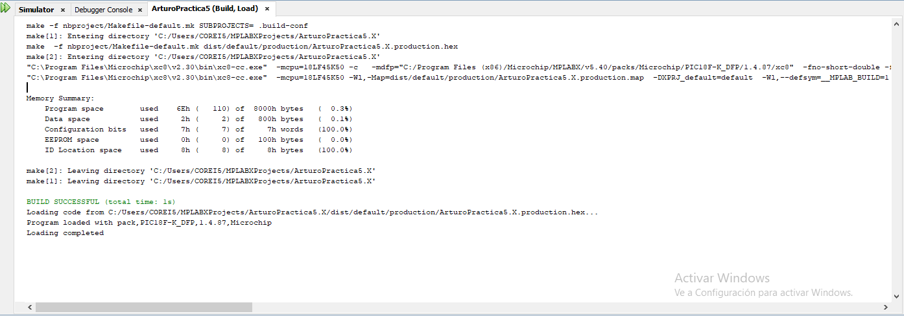
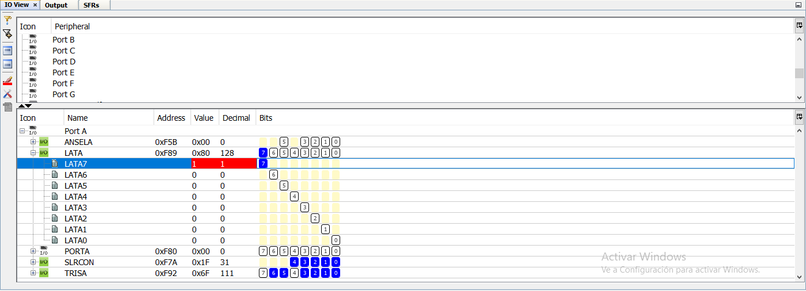

## Report Practice 5
For this practice, add to the Result Section the following:
image of the BUILD SUCCESSFUL window.

image of each modified register for the portInit() function when you debug the code step by step. TIP: Put a breakpoint at the first line of the porInit( ) function and open the IO window (Window → Debugging → IO View). Also, modify the Conclusions Section and your names at the top of the document.

### File uploads
Commit and push the file main.c created once you completed all the steps of the document in the repository.
The code is in the attached files.

### Demonstration
Record a video of the practice’s functionality and upload it on youtube. The video must contain a short explanation.
https://youtu.be/5U2g05OrTuI

### Conclusion

The practice number five itself wasn't that hard, the instalation process was the hardest for me. The guide was clear, but I think it has something to do with the newer version of the MPLAB software no having the compilers directly added, I had to download on my own the compiler needed to be able to create the proyect. Another correction that i needed to do from the steps it was that the main code had a problem since the tags LED_ON and LED_OFF where later refered to as LEDS_ON and LEDS_OFF, producing a problem that made the program not buildable, not sure if this was intended in order for our better understanding of the excercise.
